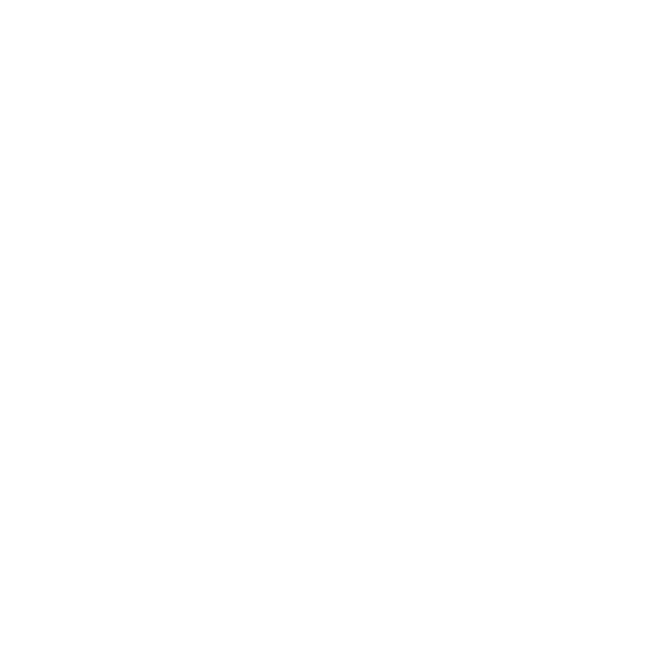

<h1 align="center">Hi there, I'm Artem
</h1>
<h3 align="center">Backend developer from Russia</h3>

### Connect with me:

### Languages:

 

 

 

### Frameworks:

 

 
 

### Tools:

 
 
 
 
 
 
 

### Services

 
 
 
 

